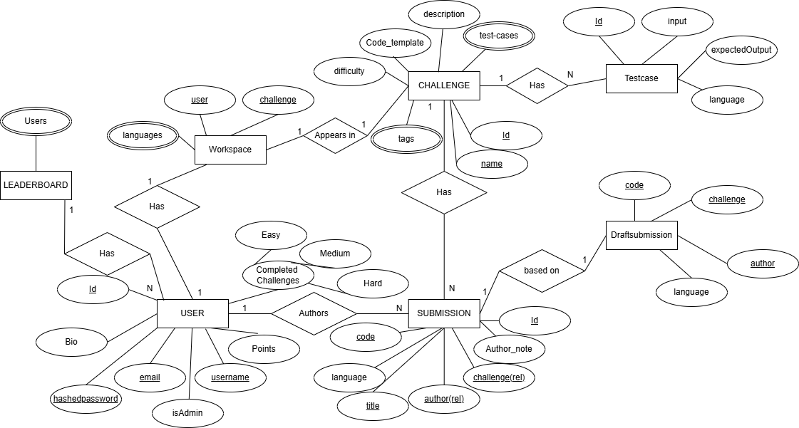
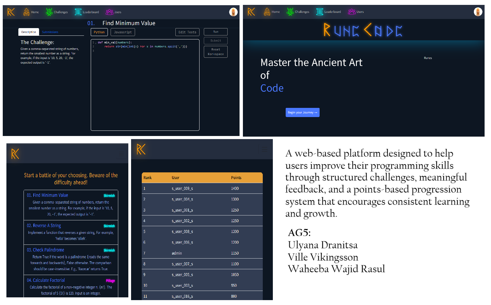

# RuneCode
This project was created by me and my peers in the course DIT342 Project: Web Engineering at the University of Gothenburg. We were given a barebones template for web development, as there was no prerequisite knowledge of web dev.
## System Definition (MS0)

### Purpose

The system will provide an interactive platform where users can practice their coding skills directly in the browser and get instant feedback on their solutions. Users are motivated to keep practicing by comparing to others' solutions and climbing the leaderboard by gaining points.

### Pages

* Home: The name of the app is clearly visible. The user can choose what activity to do: challenge (opens a list of challenges) or versus session (choose a difficulty). All other pages are navigable to.
* Challenges: A list of clickable challenges.
* Challenge: A title, instructions, and a coding input window is visible. The user can write their code and submit it for validation. Can also navigate to challenge's submissions.
* Challenge submissions: A list of all submissions for a given challenge, each clickable to navigate to the submissions page. Can also navigate back to challenge page.
* Leaderboard: A leaderboard based on users points/score/rank is displayed. The top X users are shown, as well as your own position. Usernames are clickable and navigates to the profile.
* User profile: Shows user stats and allows to navigate to their submissions and challenges that they completed.
* Submission: Displays the code and the note of the author of the submission. It is also clear what challenge it was submitted for, and whether it passed or failed.

### Entity-Relationship (ER) Diagram

## Teaser (MS3)

## Advanced Feature Proposal
### Running and evaluating arbitrary code.
#### Context:
We are building a coding website similar to codewars or leetcode that will let users hone their coding skills through solving challenges. In our minimum viable product, the user can write Javascript into a window, that then runs in the front-end. The window is a simple html \<input\> tag, without the look and feel of a classic IDE (i.e. line numbers and syntax highlighting). After running the code, the user is informed whether their code was correct or not.

#### Feature
In this advanced feature, the user will be able to choose between two programming languages, Python and Javascript. The app will automatically detect the language and provide syntax highlighting as well as line numbers. The code will not run in the browser anymore, but in a secure container in the back-end. In addition to knowing whether the code ran successfully or not, the user will know how many tests the code passed, as well as what test the code failed at, in case it did.

#### Front-end extension:
The coding window will provide syntax highlighting, line numbers, and automatic indentation, giving an authentic coding experience to the user.

#### Back-end extension:
This feature requires that we use docker to containerize the execution of the arbitrary code, as well as communicate with the container through stdout and stdin. Algorithmic thinking is needed to solve issues such as “what if the user adds a load of print commands, messing with the stdout stream” or “what if the user writes while True: continue, and sends the code for execution?”.
